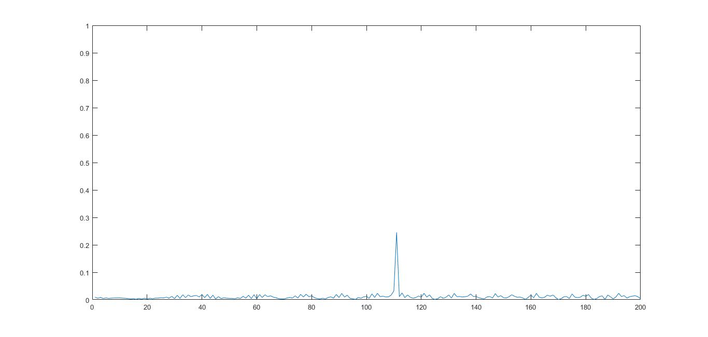
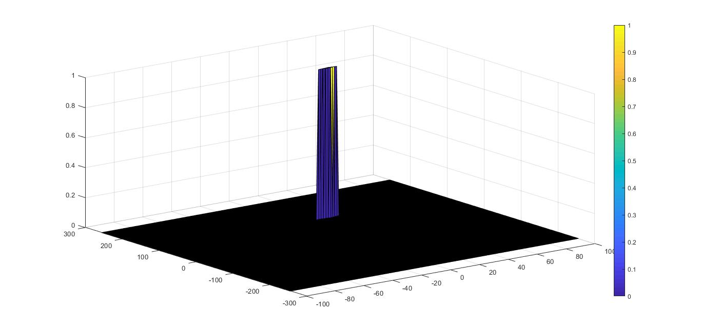
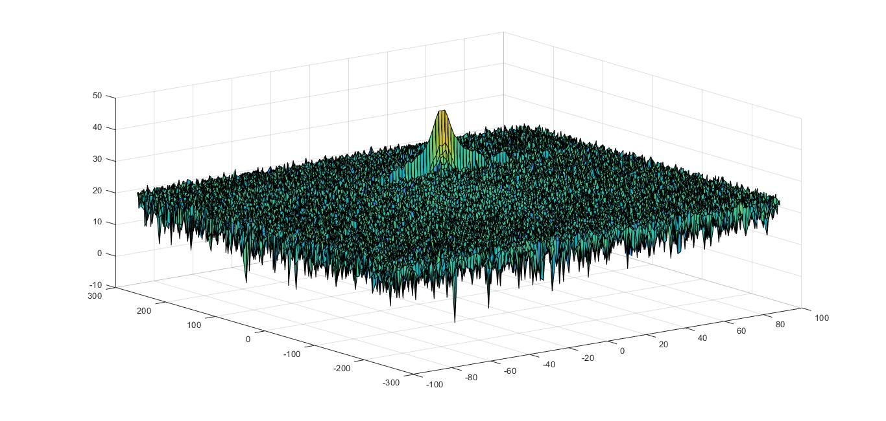

# Radar Target Generation and Detection
#### 1. FMCW Waveform Design
Using the given system requirements, design a FMCW waveform. Find its Bandwidth (B), chirp time (Tchirp) and slope of the chirp.

Radar Specifications 
```Matlab
% Frequency of operation = 77GHz
% Max Range = 200m
range_max = 200;
% Range Resolution = 1 m
delta_r = 1;
% Max Velocity = 100 m/s

%speed of light = 3e8
c = 3e8;
```

User Defined Range and Velocity of target
```matlab
pos = 110;
vel = 20;
```

FMCW Waveform Generation
```matlab
B = c / (2 * delta_r);
Tchirp = 5.5 * (2 * range_max / c);
slope = B / Tchirp;
```

#### 2. Simulation Loop
Simulate Target movement and calculate the beat or mixed signal for every timestamp.

Operating carrier frequency of Radar 
```Matlab
fc= 77e9;             %carrier freq
```
The number of chirps in one sequence. Its ideal to have 2^ value for the ease of running the FFT for Doppler Estimation. 
```matlab
Nd=128;                   % #of doppler cells OR #of sent periods % number of chirps
```

The number of samples on each chirp. 
```matlab
Nr=1024;                  %for length of time OR # of range cells
```
Simulation.
```matlab
t=linspace(0,Nd*Tchirp,Nr*Nd); %total time for samples

Tx=zeros(1,length(t)); %transmitted signal
Rx=zeros(1,length(t)); %received signal
Mix = zeros(1,length(t)); %beat signal

r_t=zeros(1,length(t));
td=zeros(1,length(t));

%% Signal generation and Moving Target simulation
% Running the radar scenario over the time. 
for i = 1 : length(t)
    r_t(i) = 110 + vel * t(i);
    td(i) = 2 * r_t(i) / c;

    Tx(i) = cos(2*pi * (fc * t(i) + slope * t(i)^2 / 2));
    Rx(i) = cos(2*pi * (fc * (t(i) - td(i)) + slope * (t(i) - td(i))^2 / 2));
    
    Mix(i) = Tx(i) * Rx(i);
end
```

#### 3. Range FFT (1st FFT)

Implement the Range FFT on the Beat or Mixed Signal and plot the result.

```Matlab
signal = reshape(Mix, [Nr, Nd]);

signal_fft = fft(signal, Nr)/Nr;
signal_fft = abs(signal_fft);
signal_fft  = signal_fft(1 : Nr/2);

%plotting the range
figure ('Name', 'Range from First FFT')
plot(abs(signal_fft))
axis ([0 200 0 1]);
```


#### 4. 2D CFAR
Implement the 2D CFAR process on the output of 2D FFT operation, i.e the Range Doppler Map.

Determine the number of Training cells for each dimension. Similarly, pick the number of guard cells.

Select the number of Training and Guard Cells in both the dimensions.
```Matlab
Tr = 8;
Td = 4;

Gr = 8;
Gd = 4;

% offset the threshold by SNR value in dB
offset = 1.35;
```


Design a loop such that it slides the CUT across range doppler map by giving margins at the edges for Training and Guard Cells. For every iteration sum the signal level within all the training cells. To sum convert the value from logarithmic to linear using db2pow function. Average the summed values for all of the training cells used. After averaging convert it back to logarithimic using pow2db. Further add the offset to it to determine the threshold. Next, compare the signal under CUT with this threshold. If the CUT level > threshold assign it a value of 1, else equate it to 0.
```Matlab
for i = 1 : (Nr/2 - (2*Gr + 2*Tr + 1))
    for j = 1 : (Nd-(2*Gd + 2*Td + 1))
        noise_level = zeros(1, 1);
        for x = i : (i + 2*Tr + 2*Gr) 
            noise_level = [noise_level, db2pow(RDM(x, (j : (j + 2*Td + 2*Gd))))];
        end    
        sum_cell = sum(noise_level);
        
        noise_level = zeros(1,1);
        for x = (i + Tr) : (i + Tr + 2*Gr) 
            noise_level = [noise_level, db2pow(RDM(x, (j + Td) : (j + Td + 2*Gd)))];
        end    
        sum_guard = sum(noise_level);
        
        sum_train = sum_cell - sum_guard;
        threshold = pow2db(sum_train / Tcell) * offset;
        signal = RDM(i + Tr + Gr, j + Td + Gd);
        if (signal < threshold)
            signal = 0;
        else
            signal = 1;
        end    
        CFAR(i + Tr + Gr, j + Td + Gd) = signal;
    end
end
```

The process above will generate a thresholded block, which is smaller than the Range Doppler Map as the CUT cannot be located at the edges of matrix. Hence,few cells will not be thresholded. To keep the map size same set those values to 0. 
```Matlab
for i = 1 : (Nr/2)
    for j = 1 : Nd
       if (i > (Tr + Gr)) & (i < (Nr/2 - (Tr + Gr))) & (j > (Td + Gd)) & (j < (Nd - (Td + Gd)))
           continue
       end
       CFAR(i, j) = 0;
    end
end
```
Plotting the CFAR output
```matlab
figure; surf(doppler_axis, range_axis, CFAR);
colorbar;
```


### All Output Plots
Range from FFT

2D FFT

CFAR Output

